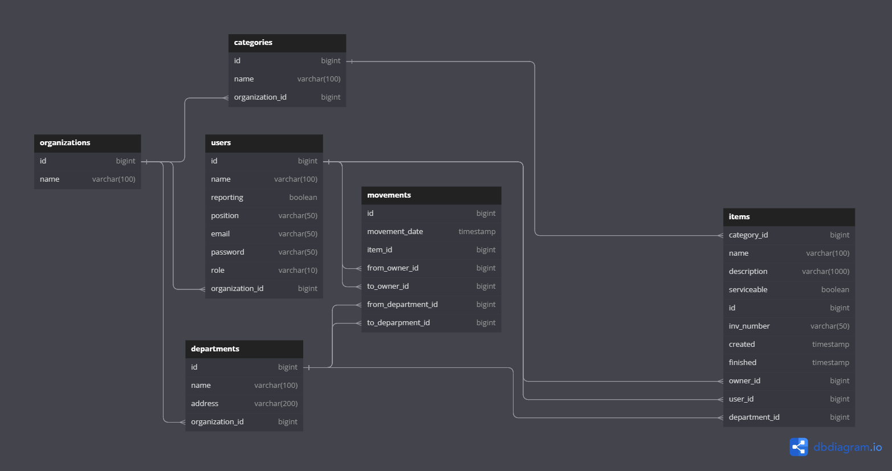

# Inventory

Pet-проект для организации учета компьютерной техники и ПО

### Идея проекта

Данный сервис позволяет вести учет оборудования и оргтехники на предприятии, а также позволяет фиксировать установленное ПО с лицензиями. В некоторых организациях приходится довольно часто "перетаскивать" оборудование между отделами и людьми. Бухгалтерия не может оперативно фиксировать изменения. Этот сервис позволяет фиксировать все движения и периодически выдавать данные для сверки. Системный администратор при переносе или установке нового оборудования может быстро в смартфоне сделать пометки.

Жизненный цикл работы с сервисом представляется следующим. Пользователь проходит регистрацию в сервисе, то есть создает себе аккаунт, представляющий сочетание логина(адреса электронной почты) и пароля. На почту приходит ссылка с подтверждением регистрации. После этого он становится администратором организации. В своем личном кабинете он может редактированить данные организации (название), создавать список отделов (отдел/филиал/участок/кабинет), создавать новых пользователей. Роли пользователей создаются при создании (администратор/пользователь). Позже их можно изменять. У отделов меняется только название. Также создается список категорий оборудования (например мониторы, МФУ, телефоны). Оборудование у каждого пользователя будет разбито по этим категориям. Без категорий оборудования быть не должно. Дальше создается список оборудования (инв. номер, название, категория, дата принятия, подотчетное лицо и фактический пользователь). Основная особенность состоит в том, что оборудование может числиться за одним сотрудником, а фактически им пользуется совсем другой человек. Для ПО указывается сама лицензия дата начала и дата её окончания. Должен быть как минимум один пользователь и как минимум один администратор ресурса.

### Требования
* Приложение представляет из себя api-сервис
* Авторизация пользователей
* Поддержка двух ролей пользователей: администратор и обычный пользователь
* Спецификация предоставляется в редакторе Swagger 
* Хранение истории перемещений

### Функции администратора
* создание, редактирование пользователей
* редактирование данных организации
* создание, редактирование категорий оборудования
* создание, редактирование списка оборудования
* перемещение оборудования между подотчетными лицами

### Функции пользователя
* просмотр всего списка оборудования 
* поиск оборудования по инвентарному номеру
* фильтрация оборудования по нескольким параметрам (категория, подотчетное лицо, фактический пользователь, отдел)

### Задумки для развитие

В дальнейшем желательно сделать front-end часть приложения с простым и понятным интерфейсом. Никаких форм строгой 
отчетности выводить не планируется.  

### Используемый стек
Java, Spring boot, Hibernate, PostgresSql, Docker, Swagger 

### Дневник изменений
Изменения можно посмотреть по коммитам. Здесь же будет отражен ход мыслей, что хотелось сделать и что пришлось 
переделать. 

Составлена er-диаграмма фиксированного состояния системы. Здесь может быть несколько организаций. У каждой и них может быть несколько категорий, пользователей и отделов. Само оборудование привязано к конкретной категории. По этой схеме можно сделать выборки оборудования по разным параметрам: категория, подотчетному лицу, фактическому пользователю, отделу, названию.

Добавлена таблица для фиксации перемещений. Здесь можно делать, что и ранее, но и история будет записана. Не совсем хорошо, что для переноса оборудования от одного подотчетного лица к другому либо при перемещении между отделами придется сделать два запроса (запись в таблицу items и movements)

Изменена схема БД. Теперь привязка оборудования к пользователям и отделам идет только в таблице moving. Плохо только, что оборудование может быть некоторое время без связи к лицу и отделу. При создании оборудования нужно сделать два запроса (запись в таблицу items и movements), но при перемещениях, а это большая часть работы сервиса будет необходим только один запрос.

Инвентарный номер следует сделать строкой, так и искать проще будет (по части номера) и возможны разные буквенные префиксы.

Оказывается, слово "end" нельзя использовать в качестве названия поля в PostgreSql. Переименовал пару полей(start->created, end->finished)

Администратор может создавать новое перемещение. Это хорошо, а если вдруг ошибся и не туда засандалил? Можно ли исправлять? Если да, то возможны проблемы при исправлении давнешнего перемещения, ведь все, что после этого тоже поплывет. Хотя можно заменять две записи в БД (в предыдущей испрвлять to_owner_id, в текущей to_owner_id). Тогда все будет ОК. При создании перемещения тоже будет две записи. Выгоды по сравнению со второй схемой сомнительна. Только запросы сложнее. Но пока так поковыряюсь.

Изменил схему БД. Теперь в одно перемещение можно включать целый список оборудования. Вроде как так легче изменения вносить и убираем дублирующую информацию.

Для регистрации новой организации нужно поле с кодом активации и указанием, что активация успешна.
Добавил нужные поля в схему БД.

Добавил поля from_user_id и to_user_id в перемещения, ведь клювая информация - это то, где оборудование фактически находится.

